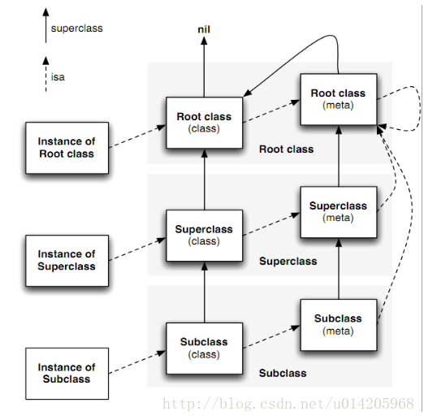

# instance

1. instance 对象在内存存储的信息

- isa：isa指针继承自NSObject，排在结构体第一位 指向对象的地址

- 其他成员变量

 

 # class 类对象

1. -[objc class] + [NSObject class] object_getClass(),三个方法均是获取objc的实例对象

 

2. 上述方法获取到的对象是同一个对象，每个类在内存中有且只有一个class类对象

 

3. class类对象在内存中储存的信息主要包括

- isa指针，指向元类

- superClass指针

- 类的属性信息(@property)、类的对象方法(instance method)

- 类的协议信息(@protocol)、类的成员变量信息(ivar)(这里指的不是成员变量的值，值是储存在实例对象中，这里是成员变量的类型，名称)

```
struct objc_class {

   Class _Nonnull isa OBJC_ISA_AVAILABILITY;


   Class _Nullable super_class               OBJC2_UNAVAILABLE;

   const char * _Nonnull name                OBJC2_UNAVAILABLE;

   long version                       OBJC2_UNAVAILABLE;

   long info                        OBJC2_UNAVAILABLE;

   long instance_size                    OBJC2_UNAVAILABLE;

   struct objc_ivar_list * _Nullable ivars         OBJC2_UNAVAILABLE;

   struct objc_method_list * _Nullable * _Nullable methodLists          OBJC2_UNAVAILABLE;

   struct objc_cache * _Nonnull cache            OBJC2_UNAVAILABLE;

   struct objc_protocol_list * _Nullable protocols     OBJC2_UNAVAILABLE;


 } OBJC2_UNAVAILABLE;
```

 

# meta class 元类对象

1. 通过object_getClass()方法获取类对象的isa指针，得到元类对象。

2. 类对象的isa指针 指向的是元类对象（实例对象的isa指针指向的是类对象）

3. 每个类再内存中有且只有一个meta-class对象

4. meta-class和类对象都是Class，他们的结构是一样的，只是用途不一样，在结构体中不需要的成员置为null

5. 元类对象在内存中储存的主要信息包括：

- isa指针 指向NSObject的元类对象

- superClass指针

- 类的类方法信息

 

 # 三种对象之间的关系



### 方法调用方式：

```
xcrun -sdk macosx clang -arch-arm64 -rewrite-objc main.m -o main.cpp
```


- 对象方法
  1. student 通过isa指针找到其类对象 TZStudent
  2. 在TZStudent中查找实例方法- (void)study;
  3. 给student发送消息，sendMessage(student, SEL(study))
- 类方法
  1.  student通过isa找到类对象，再通过类对象isa指针找到元类对象
  2. 在元类对象中查找TZStudent的类方法-（void）sleep；
  3. 给TZStudent类对象发送消息，sendMessage((id)objc_getClass("TZStudent"), sel_registerName("die"))


### 调用类方法时，有可能会从NSObject类对象中拿到实例方法去执行

```
@interface NSObject (addition)

- (void)methodFromNSObject;

@end

@implementation NSObject (addition)

- (void)methodFromNSObject {
    NSLog(@"methodFromNSObject");
}

@end

@interface TZStudent : TZPerson
- (void)study;
@end


// 调用类方法时，回到元类中查找类方法，没有找到查找元类的父类，直到元类的基类，此时元类的基类的superclass指针指向的是NSObject的类对象，类对象中的对象方法此时也会被查找，这个正好有这个同名的对象方法，因此会调用该对象方法

[TZStudent performSelector:**@selector**(methodFromNSObject)];
```


